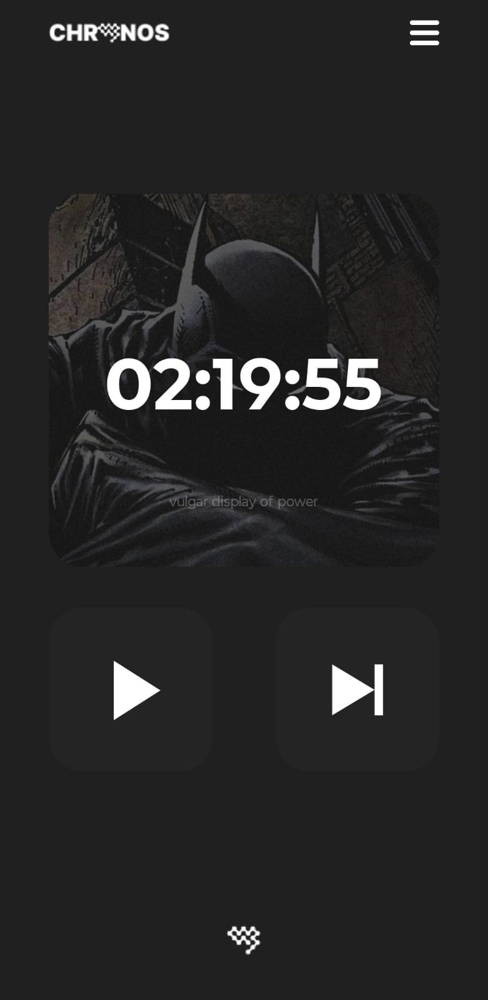

# Chronos - Aplicativo de Pomodoro

Chronos é um aplicativo de **Pomodoro** desenvolvido em **React Native** com **TypeScript**, projetado para gerenciar o tempo de uma sessão de estudo ou trabalho de forma eficiente e organizada.

Resolvi fazer esse projeto para testar um pouco dos meus conhecimentos iniciais em React Native e, ao mesmo tempo, algo que fosse útil para mim e tivesse utilidade no meu dia a dia.

---

## 📝 Funcionalidades Atuais

- Timer de Pomodoro configurável, você pode escolher o tempo da sessão e o de tempo de pausa.
- Interface simples e intuitiva
- Contagem regressiva visual do tempo

---

## ⚙️ Tecnologias Utilizadas

- [React Native](https://reactnative.dev/)
- [TypeScript](https://www.typescriptlang.org/)

---

## 🔮 Funcionalidades Futuras

- [ ] Adição de animações no timer
- [ ] Possibilidade de adicionar tempo extra através de botões
- [ ] Implementação de uma fonte mais agradável
- [ ] Integração com o projeto **Mnemosyne**

---

## 📸 Screenshots

Tela Inicial do App:  

